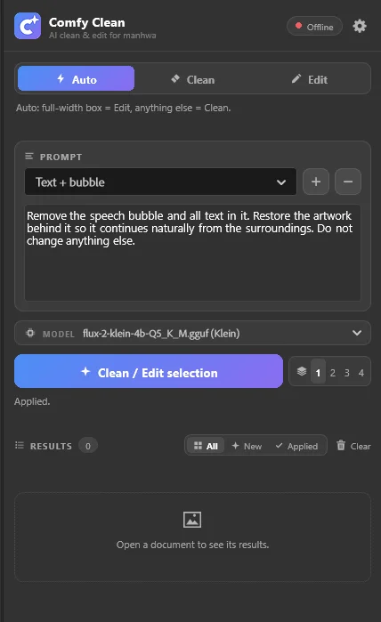
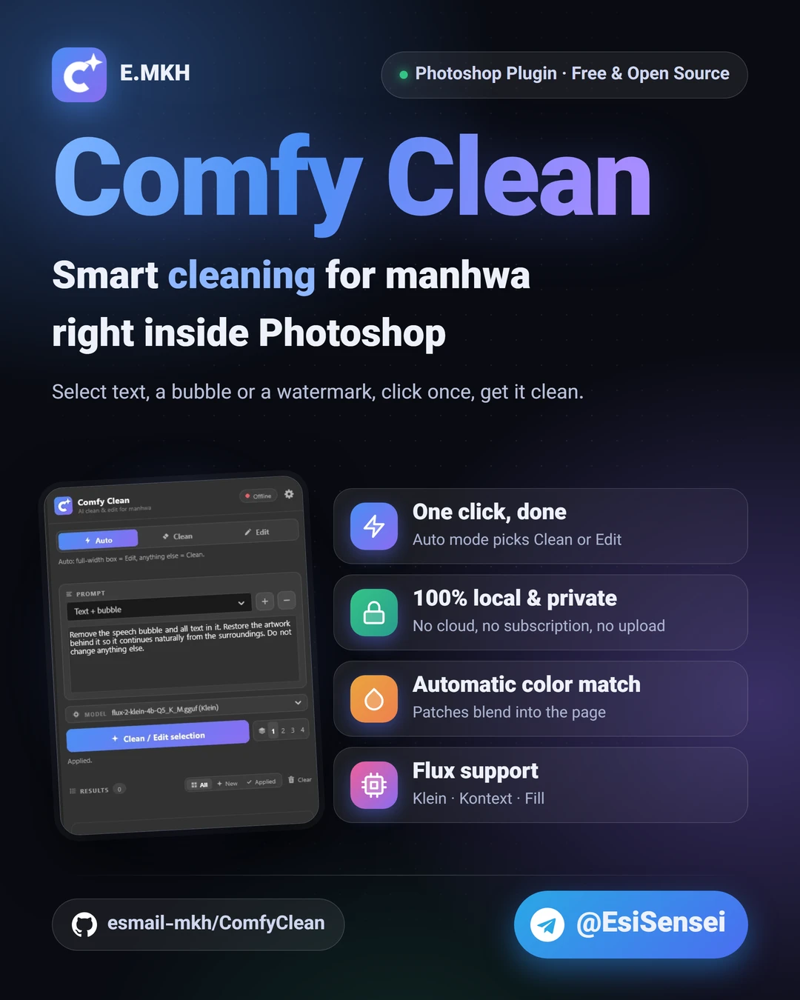
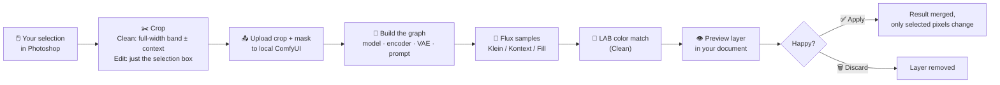
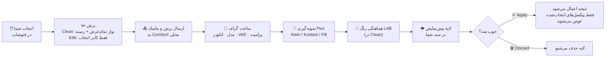

<div align="center">


# ✨ Comfy Clean ✨

### 🧹 AI clean &amp; edit for manhwa, right inside Photoshop

Select the text, the bubble, the SFX or the watermark → click once → get a clean page back from **your own local ComfyUI**. 🎨

<br>

[](#-install)
[](https://github.com/comfyanonymous/ComfyUI)
[](#-models)
[](#-install)
[](#-requirements)
[](plugin/manifest.json)

<br>

🌐 **[English](#english)** &nbsp;|&nbsp; **[فارسی](#persian)**

<br>

&nbsp;&nbsp;&nbsp;

<sub>🖼️ The panel inside Photoshop · پنل داخل فتوشاپ</sub>

</div>

---

<a id="english"></a>

# 🇬🇧 English

> 🔒 **Everything runs on your PC.** No cloud, no subscription, no upload: your pages never leave your computer.

## 📑 Contents

[Why](#-why-comfy-clean) · [Features](#-features) · [How it works](#-how-it-works) · [Modes](#-clean-vs-edit-vs-auto) · [Presets](#-prompt-presets) · [Models](#-models) · [Requirements](#-requirements) · [Install](#-install) · [Quick start](#-quick-start) · [Settings](#%EF%B8%8F-settings) · [Troubleshooting](#-troubleshooting) · [Build and test](#-build-and-test) · [Layout](#-project-layout)

## 💡 Why Comfy Clean?

Cleaning a manhwa or manga page by hand means hours of clone-stamping text out of screentones, bubbles and artwork. Comfy Clean is a Photoshop panel that does it with a Flux model running in your own ComfyUI:

- 🖱️ **One click** instead of one hour of stamping.
- 🧠 **Understands the art**: it continues lines, colors and screentone instead of smearing them.
- 🏠 **Private and free**: local models, local GPU, nothing is sent anywhere.
- 🔁 **Non-destructive**: every result is a preview layer you **Apply** or **Discard**.

## 🚀 Features

| | Feature | Details |
|:-:|---|---|
| 🧹 | **One-click clean** | Make a selection of any shape, press *Clean selection*. |
| ⚡ | **Auto / Clean / Edit** | Auto picks the right mode from the selection and follows the active document live. |
| 📝 | **Prompt presets** | 8 ready-made prompts (text, bubble, SFX, watermark, object). Save, overwrite and delete your own. |
| 🎲 | **1-4 variations** | Make up to 4 results per click and keep the best one. |
| 👁️ | **Preview, Apply, Discard** | Results appear as a preview layer in your document. Nothing changes until you Apply. |
| 🗂️ | **Results list** | Thumbnails, timings, *All / New / Applied* filters, Retry on failures, clear finished. |
| 🎨 | **Color match** | Matches the patch to its surroundings in LAB space, so cleaned areas are never darker or lighter. |
| 🧠 | **Smart model picking** | Finds the right text encoder and VAE by itself and tells you exactly what to download if one is missing. |
| 🚦 | **Starts ComfyUI for you** | Point it at your ComfyUI folder: it launches it minimized and waits until it is ready. |
| 🐕 | **Stuck watchdog** | Restarts a job automatically if a sampling step takes too long. |
| 🌗 | **Dark and light themes** | Follows Photoshop's UI theme. |
| 🕰️ | **Photoshop 2022 mode** | A compatibility path for older Photoshop versions. |
| ⌨️ | **Menu command** | *Plugins › Comfy Clean: Clean selection*, so you can bind your own shortcut. |

## 🔧 How it works



A few details worth knowing:

- 📏 Only the **crop** goes to ComfyUI, so page height never matters. It is scaled to about 1 MP for the model, and uploads are capped at 2048 px on the long side.
- 🧼 Reading the page leaves **no history entry** in Photoshop.
- 🎯 In Clean the exact selection is the mask, at full resolution, so everything outside it stays pixel-identical.
- 💾 Your settings and presets are saved as you change them. Results live in memory only and are gone when Photoshop closes.

## 🧭 Clean vs Edit vs Auto

| | 🧹 Clean | ✏️ Edit | ⚡ Auto |
|---|---|---|---|
| **What it does** | Masked **inpaint**: only the selected pixels are replaced | Regenerates the **whole selection box** from your prompt | Chooses between the two for you |
| **Context sent** | Full-width strip around the selection (± *Context* px) | Just the selection box | |
| **Edges** | Exact selection shape | Top and bottom fade into the original (*Edit fade*) | |
| **Best for** | Text, bubbles, SFX, watermarks, small or irregular areas | Big regions, e.g. a box across the full page width | Everyday use |
| **Models** | Klein · Kontext · Fill | Klein · Kontext | |

⚡ **Auto rule:** a small or irregular selection → *Clean*. A tidy full-width rectangle → *Edit*.

## 📝 Prompt presets

| Preset | Use it to |
|---|---|
| 🔤 **Text (auto)** | Remove all text and sound effects, keep the surroundings identical |
| 💥 **Text (auto), keep SFX** | Remove dialogue text but keep sound effects like GRRR / BOOM |
| 💬 **Text, keep bubble** | Remove text and keep the bubble's shape, outline, tail and fill |
| 🔠 **Text** | Simple text removal |
| 🫧 **Text + bubble** | Remove the bubble and its text, restore the art behind it |
| 💢 **SFX** | Remove sound-effect lettering |
| 🏷️ **Watermark** | Remove a logo with its icon, lettering and glow, keeping panel borders straight |
| 📦 **Object** | Remove the selected object and fill in what should be behind it |

Press **＋** to save the current prompt as your own preset, **－** to delete the selected one.

## 🤖 Models

| Family | 🧹 Clean | ✏️ Edit | Text encoder | Notes |
|---|:-:|:-:|---|---|
| **Flux.2 Klein 4B** | ✅ | ✅ | Qwen3-4B | Fast, light on VRAM |
| **Flux.2 Klein 9B** | ✅ | ✅ | Qwen3-8B | Higher quality |
| **Flux.1 Kontext** | ✅ | ✅ | T5-XXL + clip_l | |
| **Flux.1 Fill** | ✅ | ❌ | T5-XXL + clip_l | Inpaint only |

- 🔎 The family is detected from the file name: `klein` / `flux2`, `kontext`, `fill`. Other models are not listed.
- 📦 Formats: plain `.safetensors`, **GGUF** and **Nunchaku** `svdq` (Flux.1 only).
- 🎛️ Steps default to the model's own value. Change them in Settings if you want.

## 📋 Requirements

- 🖼️ **Photoshop 2022 (23.3) or newer**: developed on 2024 and 2026.
- 🧩 **[ComfyUI](https://github.com/comfyanonymous/ComfyUI)** running locally (default `http://127.0.0.1:8188`) and **up to date**.
- 🤖 At least one supported model, plus its text encoder and VAE. The panel shows download links for whatever is missing.
- 🔌 Custom nodes:

| Custom node | Needed for |
|---|---|
| [comfyui-inpaint-nodes](https://github.com/Acly/comfyui-inpaint-nodes) | ⚠️ **Required** for Clean's color match (or set *Color match* to `0`) |
| [ComfyUI-GGUF](https://github.com/city96/ComfyUI-GGUF) | Only for `.gguf` models and encoders |
| [ComfyUI-nunchaku](https://github.com/nunchaku-tech/ComfyUI-nunchaku) | Only for `svdq` models |

- 🪟 **Windows** for the automatic ComfyUI start (everything else is plain UXP).

> 💡 The panel checks all of this for you: **Settings** lists any missing custom node, text encoder or VAE with a clickable download link.

## 📥 Install

### Option A: installer (easiest) 🎁

1. Download **`ComfyClean.ccx`** from [Releases](https://github.com/esmail-mkh/ComfyClean/releases).
2. Double-click it. Creative Cloud installs the plugin.
3. Restart Photoshop.

### Option B: copy the folder 📁

Copy the **contents** of [`plugin/`](plugin) to:

```text
<Photoshop folder>\Plug-ins\ComfyClean\
```

For example `C:\Program Files\Adobe\Adobe Photoshop 2026\Plug-ins\ComfyClean\`, then restart Photoshop.

Open the panel from **Plugins › Comfy Clean**.

## ⚡ Quick start

1. ▶️ Start ComfyUI, or let the panel do it: *Settings › Connection › ComfyUI folder*.
2. 🟢 Wait for the green dot in the panel header.
3. 🎯 Make a selection on the text, bubble or watermark.
4. 📝 Pick a preset (or type your own prompt) and a model.
5. ✨ Click **Clean selection** (or **Edit selection**).
6. 👁️ Look at the preview, then **✅ Apply** or **🗑️ Discard**.

## ⚙️ Settings

| Setting | What it does | Default |
|---|---|:-:|
| 🤖 Model | The diffusion model to use (also in the quick picker on the main page) | |
| 🔤 Text encoder / 🎞️ VAE | Leave on *auto*, or pick a file by hand | auto |
| 🔢 Steps | `0` = the model's own default | `0` |
| ↕️ Context above/below (px) | Extra rows of context around the selection in Clean | `96` |
| 🎨 Color match | `0` to `1`, Clean only. `0` turns it off | `1` |
| 🐕 Auto-retry after | Seconds per step before a stuck job restarts. `0` = off | `30` |
| 🌫️ Edit fade | Edge fade in % of the height. `0` = off | `7` |
| 🌐 ComfyUI URL | Where ComfyUI listens | `http://127.0.0.1:8188` |
| 📂 ComfyUI folder | Lets the plugin start ComfyUI (portable build or a `main.py` folder, venv supported) | |
| 👁️ Show new results right away | Off: results wait in the list until you click them | on |
| 🕰️ Photoshop 2022 mode | Forces the older API path. Always on in Photoshop 2022 and early 2023 | off |

## 🩺 Troubleshooting

<details>
<summary>🔴 The dot is red or says "ComfyUI offline"</summary>

Start ComfyUI, or set the **ComfyUI folder** in Settings so the plugin can start it. Then press **Test connection**.
</details>

<details>
<summary>🧩 Clean says it needs a custom node</summary>

Install [comfyui-inpaint-nodes](https://github.com/Acly/comfyui-inpaint-nodes) and restart ComfyUI. Or set **Color match** to `0` to run without it (the patch may come out slightly darker or lighter).
</details>

<details>
<summary>📦 "No text encoder / VAE found"</summary>

Settings shows the exact files and links. Download them into the folders shown (`ComfyUI/models/text_encoders`, `ComfyUI/models/vae`), then press **Test connection**. No ComfyUI restart needed for model files.
</details>

<details>
<summary>💥 Shape error in the sampler with Klein</summary>

The text encoder size must match the model: **Klein 4B → Qwen3-4B**, **Klein 9B → Qwen3-8B**. Leave the encoder on *auto* and the plugin picks the right one.
</details>

<details>
<summary>🚫 "Fill models only inpaint"</summary>

Flux.1 Fill cannot do Edit. Use **Clean**, or pick a Klein / Kontext model for Edit.
</details>

<details>
<summary>🌗 Cleaned area is darker or lighter than the page</summary>

Make sure **Color match** is `1` and comfyui-inpaint-nodes is installed.
</details>

<details>
<summary>🐌 A job seems stuck</summary>

The watchdog restarts a job when one step takes longer than *Auto-retry after* seconds. Raise that value on a slow GPU, or press **Retry** on the failed result.
</details>

<details>
<summary>🪟 The plugin does not show up in Photoshop</summary>

Make sure the files are in `Plug-ins\ComfyClean\` directly (`manifest.json` must be in that folder, not in a subfolder), then restart Photoshop.
</details>

## 🧪 Build and test

```bash
# build the installer
python -c "import shutil;shutil.make_archive('dist/ComfyClean','zip','plugin')"
# then rename dist/ComfyClean.zip to dist/ComfyClean.ccx

node tests/test_models.js        # model picking, no ComfyUI needed
node tests/test_selection.js     # selection mask reading
node tests/test_paths.js         # Clean + preview against a fake Photoshop
python tests/test_workflow.py    # live ComfyUI (add --edit, --model NAME)
```

🔖 The version lives only in [`plugin/manifest.json`](plugin/manifest.json).

## 🗺️ Project layout

```text
plugin/
├─ manifest.json    plugin id, version, permissions
├─ index.html       panel UI (dark + light themes)
├─ index.js         Photoshop + ComfyUI logic
├─ models.js        model family, encoder / VAE picking, graph building
├─ workflows/       ComfyUI API templates: flux2 · kontext · fill  ×  clean · edit
└─ icons/           panel and plugin icons
tests/              node and python checks
```

## 🛠️ Built with

🟦 Adobe **UXP** (Photoshop Imaging API) · 🟨 plain **JavaScript**, no build step, no dependencies · 🧩 **ComfyUI** API + WebSocket · 🤖 **Flux.2 Klein / Flux.1 Kontext / Flux.1 Fill**

---

<a id="persian"></a>

<div dir="rtl" align="right">

# 🇮🇷 فارسی

<p align="center"></p>

> 🔒 **همه‌چیز روی کامپیوتر خودتان اجرا می‌شود.** بدون ابر، بدون اشتراک، بدون آپلود: صفحه‌های شما هیچ‌جا فرستاده نمی‌شوند.

## 📑 فهرست

[چرا Comfy Clean](#-چرا-comfy-clean) · [امکانات](#-امکانات) · [چطور کار می‌کند](#-چطور-کار-میکند) · [حالت‌ها](#-حالتها) · [پرامپت‌های آماده](#-پرامپتهای-آماده) · [مدل‌ها](#-مدلها) · [پیش‌نیازها](#-پیشنیازها) · [نصب](#-نصب) · [شروع سریع](#-شروع-سریع) · [تنظیمات](#%EF%B8%8F-تنظیمات) · [رفع مشکل](#-رفع-مشکل) · [ساخت و تست](#-ساخت-و-تست) · [ساختار پروژه](#%EF%B8%8F-ساختار-پروژه)

## 💡 چرا Comfy Clean

تمیز کردن یک صفحهٔ مانهوا یا مانگا با دست یعنی ساعت‌ها کلون‌استمپ کردن متن از روی تُن‌ها، بالن‌ها و نقاشی. Comfy Clean یک پنل فتوشاپ است که همین کار را با یک مدل Flux روی ComfyUI خودتان انجام می‌دهد:

- 🖱️ **یک کلیک** به‌جای یک ساعت کلون‌استمپ.
- 🧠 **نقاشی را می‌فهمد**: خط‌ها، رنگ‌ها و تُن را ادامه می‌دهد، نه اینکه لکه‌اش کند.
- 🏠 **خصوصی و رایگان**: مدل و کارت گرافیک خودتان، و هیچ چیزی به بیرون فرستاده نمی‌شود.
- 🔁 **غیرمخرب**: هر نتیجه یک لایهٔ پیش‌نمایش است که **Apply** یا **Discard** می‌کنید.

## 🚀 امکانات

| | امکان | توضیح |
|:-:|---|---|
| 🧹 | **تمیزکاری با یک کلیک** | یک انتخاب با هر شکلی بسازید و *Clean selection* را بزنید. |
| ⚡ | **Auto / Clean / Edit** | حالت Auto از روی انتخاب، حالت درست را خودش برمی‌دارد و با سند فعال هم‌زمان عوض می‌شود. |
| 📝 | **پرامپت‌های آماده** | ۸ پرامپت آماده (متن، بالن، افکت صوتی، واترمارک، شیء). پرامپت خودتان را هم ذخیره، جایگزین یا حذف کنید. |
| 🎲 | **۱ تا ۴ خروجی** | در هر کلیک تا ۴ نتیجه بسازید و بهترین را نگه دارید. |
| 👁️ | **پیش‌نمایش، Apply، Discard** | نتیجه به‌صورت یک لایهٔ پیش‌نمایش در سند می‌آید. تا Apply نکنید چیزی عوض نمی‌شود. |
| 🗂️ | **فهرست نتایج** | تصویر بندانگشتی، زمان، فیلتر *All / New / Applied*، دکمهٔ Retry برای خطاها و پاک کردن نتایج تمام‌شده. |
| 🎨 | **Color match** | رنگ وصله را در فضای LAB با اطرافش هماهنگ می‌کند تا ناحیهٔ تمیزشده هیچ‌وقت تیره‌تر یا روشن‌تر نباشد. |
| 🧠 | **انتخاب هوشمند مدل** | انکودر متن و VAE درست را خودش پیدا می‌کند و اگر چیزی کم باشد دقیقاً می‌گوید چه چیزی را دانلود کنید. |
| 🚦 | **اجرای خودکار ComfyUI** | پوشهٔ ComfyUI را نشان بدهید؛ پلاگین آن را مینیمایز اجرا می‌کند و صبر می‌کند تا آماده شود. |
| 🐕 | **نگهبان گیرکردن** | اگر یک مرحلهٔ sampling بیش از حد طول بکشد، کار را خودکار دوباره اجرا می‌کند. |
| 🌗 | **تم تیره و روشن** | از تم رابط فتوشاپ پیروی می‌کند. |
| 🕰️ | **حالت Photoshop 2022** | مسیر سازگاری برای نسخه‌های قدیمی‌تر فتوشاپ. |
| ⌨️ | **دستور منو** | *Plugins › Comfy Clean: Clean selection*؛ می‌توانید برایش میانبر بگذارید. |

## 🔧 چطور کار می‌کند



چند نکتهٔ مهم:

- 📏 فقط **برش** به ComfyUI می‌رود، پس ارتفاع صفحه مهم نیست. برش برای مدل به حدود ۱ مگاپیکسل کوچک می‌شود و آپلود در ضلع بلند حداکثر ۲۰۴۸ پیکسل است.
- 🧼 خواندن صفحه **هیچ ردی در History** فتوشاپ نمی‌گذارد.
- 🎯 در Clean شکل دقیق انتخاب با کیفیت کامل به‌عنوان ماسک استفاده می‌شود، پس هرچه بیرون آن است پیکسل‌به‌پیکسل همان قبلی می‌ماند.
- 💾 تنظیمات و پرامپت‌ها هم‌زمان با تغییر ذخیره می‌شوند. نتایج فقط در حافظه‌اند و با بستن فتوشاپ از بین می‌روند.

## 🧭 حالت‌ها

| | 🧹 Clean | ✏️ Edit | ⚡ Auto |
|---|---|---|---|
| **کار** | **inpaint** با ماسک: فقط پیکسل‌های انتخاب‌شده جایگزین می‌شوند | **کل کادر انتخاب** را از روی پرامپت دوباره می‌سازد | خودش بین این دو انتخاب می‌کند |
| **زمینه‌ای که فرستاده می‌شود** | نوار تمام‌عرض دور انتخاب (± مقدار *Context*) | فقط کادر انتخاب | |
| **لبه‌ها** | دقیقاً شکل انتخاب | بالا و پایین در تصویر اصلی محو می‌شود (*Edit fade*) | |
| **مناسب برای** | متن، بالن، افکت صوتی، واترمارک، ناحیه‌های کوچک یا نامنظم | ناحیه‌های بزرگ، مثلاً کادری که تمام عرض صفحه را بگیرد | استفادهٔ روزمره |
| **مدل‌ها** | Klein · Kontext · Fill | Klein · Kontext | |

⚡ **قانون Auto:** انتخاب کوچک یا نامنظم ← *Clean*. مستطیل مرتب و تمام‌عرض ← *Edit*.

## 📝 پرامپت‌های آماده

| پرامپت | کاربرد |
|---|---|
| 🔤 **Text (auto)** | حذف همهٔ متن و افکت صوتی، بدون تغییر اطراف |
| 💥 **Text (auto), keep SFX** | حذف متن دیالوگ ولی نگه داشتن افکت‌های صوتی مثل GRRR / BOOM |
| 💬 **Text, keep bubble** | حذف متن و نگه داشتن شکل، خط دور، دم و رنگ داخل بالن |
| 🔠 **Text** | حذف ساده‌ٔ متن |
| 🫧 **Text + bubble** | حذف بالن و متنش و بازسازی نقاشی پشت آن |
| 💢 **SFX** | حذف حروف افکت صوتی |
| 🏷️ **Watermark** | حذف لوگو با آیکون، نوشته و درخششش، بدون شکستن خط کادر پنل |
| 📦 **Object** | حذف شیء انتخاب‌شده و پر کردن جای آن با چیزی که باید پشتش باشد |

با دکمهٔ **＋** پرامپت فعلی را به‌عنوان پرامپت آمادهٔ خودتان ذخیره کنید و با **－** پرامپت انتخاب‌شده را حذف کنید.

## 🤖 مدل‌ها

| خانواده | 🧹 Clean | ✏️ Edit | انکودر متن | توضیح |
|---|:-:|:-:|---|---|
| **Flux.2 Klein 4B** | ✅ | ✅ | Qwen3-4B | سریع و کم‌مصرف برای VRAM |
| **Flux.2 Klein 9B** | ✅ | ✅ | Qwen3-8B | کیفیت بالاتر |
| **Flux.1 Kontext** | ✅ | ✅ | T5-XXL و clip_l | |
| **Flux.1 Fill** | ✅ | ❌ | T5-XXL و clip_l | فقط inpaint |

- 🔎 خانواده از روی نام فایل تشخیص داده می‌شود: `klein` / `flux2`، `kontext`، `fill`. مدل‌های دیگر در فهرست نمی‌آیند.
- 📦 قالب‌ها: `.safetensors` معمولی، **GGUF** و **Nunchaku** با نام `svdq` (فقط Flux.1).
- 🎛️ تعداد Steps پیش‌فرض خود مدل است و در Settings قابل تغییر است.

## 📋 پیش‌نیازها

- 🖼️ **Photoshop 2022 (نسخهٔ 23.3) یا جدیدتر**؛ روی 2024 و 2026 توسعه داده شده است.
- 🧩 **[ComfyUI](https://github.com/comfyanonymous/ComfyUI)** در حال اجرا روی همین کامپیوتر (پیش‌فرض `http://127.0.0.1:8188`) و **به‌روز**.
- 🤖 دست‌کم یک مدل پشتیبانی‌شده به‌همراه انکودر متن و VAE آن. برای هر فایل کم، پنل لینک دانلود نشان می‌دهد.
- 🔌 کاستوم‌نودها:

| کاستوم‌نود | برای چه |
|---|---|
| [comfyui-inpaint-nodes](https://github.com/Acly/comfyui-inpaint-nodes) | ⚠️ برای color match حالت Clean **لازم است** (یا *Color match* را روی `0` بگذارید) |
| [ComfyUI-GGUF](https://github.com/city96/ComfyUI-GGUF) | فقط برای مدل‌ها و انکودرهای `.gguf` |
| [ComfyUI-nunchaku](https://github.com/nunchaku-tech/ComfyUI-nunchaku) | فقط برای مدل‌های `svdq` |

- 🪟 **ویندوز** برای اجرای خودکار ComfyUI (بقیهٔ چیزها UXP ساده است).

> 💡 پنل همهٔ این‌ها را خودش بررسی می‌کند: در **Settings** هر کاستوم‌نود، انکودر متن یا VAE ناموجود با یک لینک دانلود قابل‌کلیک نشان داده می‌شود.

## 📥 نصب

### روش اول: فایل نصب (ساده‌ترین) 🎁

۱. فایل **`ComfyClean.ccx`** را از بخش [Releases](https://github.com/esmail-mkh/ComfyClean/releases) دانلود کنید.
۲. روی آن دابل‌کلیک کنید تا Creative Cloud پلاگین را نصب کند.
۳. فتوشاپ را دوباره باز کنید.

### روش دوم: کپی پوشه 📁

**محتوای** پوشهٔ [`plugin/`](plugin) را در این مسیر کپی کنید:

</div>

```text
<Photoshop folder>\Plug-ins\ComfyClean\
```

<div dir="rtl" align="right">

برای مثال `C:\Program Files\Adobe\Adobe Photoshop 2026\Plug-ins\ComfyClean\` و بعد فتوشاپ را دوباره باز کنید.

پنل را از مسیر **Plugins › Comfy Clean** باز کنید.

## ⚡ شروع سریع

۱. ▶️ ComfyUI را اجرا کنید یا بگذارید پنل اجرایش کند: *Settings › Connection › ComfyUI folder*.
۲. 🟢 منتظر بمانید تا نقطهٔ بالای پنل سبز شود.
۳. 🎯 روی متن، بالن یا واترمارک یک انتخاب بسازید.
۴. 📝 یک پرامپت آماده (یا پرامپت خودتان) و یک مدل انتخاب کنید.
۵. ✨ روی **Clean selection** (یا **Edit selection**) بزنید.
۶. 👁️ پیش‌نمایش را ببینید و **✅ Apply** یا **🗑️ Discard** کنید.

## ⚙️ تنظیمات

| تنظیم | کاربرد | پیش‌فرض |
|---|---|:-:|
| 🤖 Model | مدل diffusion که استفاده می‌شود (در انتخابگر سریع صفحهٔ اصلی هم هست) | |
| 🔤 Text encoder / 🎞️ VAE | روی *auto* بگذارید یا فایل را دستی انتخاب کنید | auto |
| 🔢 Steps | `0` یعنی پیش‌فرض خود مدل | `0` |
| ↕️ Context above/below (px) | ردیف‌های اضافهٔ زمینه دور انتخاب در Clean | `96` |
| 🎨 Color match | بین `0` تا `1`، فقط در Clean. `0` یعنی خاموش | `1` |
| 🐕 Auto-retry after | ثانیه به‌ازای هر مرحله تا شروع دوبارهٔ کار گیرکرده. `0` یعنی خاموش | `30` |
| 🌫️ Edit fade | محو شدن لبه‌ها به درصد ارتفاع. `0` یعنی خاموش | `7` |
| 🌐 ComfyUI URL | آدرسی که ComfyUI روی آن گوش می‌دهد | `http://127.0.0.1:8188` |
| 📂 ComfyUI folder | به پلاگین اجازه می‌دهد ComfyUI را اجرا کند (نسخهٔ portable یا پوشه‌ای با `main.py`، venv هم پشتیبانی می‌شود) | |
| 👁️ Show new results right away | خاموش: نتایج در فهرست می‌مانند تا رویشان کلیک کنید | روشن |
| 🕰️ Photoshop 2022 mode | مسیر قدیمی‌تر API را اجباری می‌کند. در Photoshop 2022 و اوایل 2023 همیشه روشن است | خاموش |

## 🩺 رفع مشکل

<details>
<summary>🔴 نقطه قرمز است یا «ComfyUI offline» می‌نویسد</summary>

ComfyUI را اجرا کنید، یا در Settings پوشهٔ **ComfyUI folder** را بدهید تا پلاگین خودش اجرایش کند. بعد **Test connection** را بزنید.
</details>

<details>
<summary>🧩 Clean می‌گوید به یک کاستوم‌نود نیاز دارد</summary>

[comfyui-inpaint-nodes](https://github.com/Acly/comfyui-inpaint-nodes) را نصب کنید و ComfyUI را دوباره اجرا کنید. یا **Color match** را روی `0` بگذارید تا بدون آن کار کند (ممکن است وصله کمی تیره‌تر یا روشن‌تر شود).
</details>

<details>
<summary>📦 «No text encoder / VAE found»</summary>

Settings نام دقیق فایل‌ها و لینکشان را نشان می‌دهد. آن‌ها را در پوشه‌هایی که نوشته (`ComfyUI/models/text_encoders` و `ComfyUI/models/vae`) بریزید و **Test connection** را بزنید. برای فایل مدل‌ها لازم نیست ComfyUI را دوباره اجرا کنید.
</details>

<details>
<summary>💥 خطای shape در sampler با Klein</summary>

اندازهٔ انکودر متن باید با مدل بخواند: **Klein 4B ← Qwen3-4B** و **Klein 9B ← Qwen3-8B**. انکودر را روی *auto* بگذارید تا پلاگین درستش را انتخاب کند.
</details>

<details>
<summary>🚫 «Fill models only inpaint»</summary>

Flux.1 Fill نمی‌تواند Edit انجام بدهد. از **Clean** استفاده کنید، یا برای Edit یک مدل Klein / Kontext انتخاب کنید.
</details>

<details>
<summary>🌗 ناحیهٔ تمیزشده از بقیهٔ صفحه تیره‌تر یا روشن‌تر است</summary>

مطمئن شوید **Color match** روی `1` است و comfyui-inpaint-nodes نصب شده است.
</details>

<details>
<summary>🐌 یک کار گیر کرده به نظر می‌رسد</summary>

نگهبان وقتی یک مرحله بیشتر از *Auto-retry after* ثانیه طول بکشد کار را دوباره اجرا می‌کند. روی کارت گرافیک کند این عدد را بالاتر ببرید، یا روی نتیجهٔ ناموفق **Retry** بزنید.
</details>

<details>
<summary>🪟 پلاگین در فتوشاپ دیده نمی‌شود</summary>

مطمئن شوید فایل‌ها مستقیم در `Plug-ins\ComfyClean\` هستند (`manifest.json` باید همان‌جا باشد، نه داخل یک زیرپوشه) و فتوشاپ را دوباره باز کنید.
</details>

## 🧪 ساخت و تست

</div>

```bash
# build the installer
python -c "import shutil;shutil.make_archive('dist/ComfyClean','zip','plugin')"
# then rename dist/ComfyClean.zip to dist/ComfyClean.ccx

node tests/test_models.js        # model picking, no ComfyUI needed
node tests/test_selection.js     # selection mask reading
node tests/test_paths.js         # Clean + preview against a fake Photoshop
python tests/test_workflow.py    # live ComfyUI (add --edit, --model NAME)
```

<div dir="rtl" align="right">

🔖 نسخهٔ پلاگین فقط در [`plugin/manifest.json`](plugin/manifest.json) نگه‌داری می‌شود.

## 🗺️ ساختار پروژه

</div>

```text
plugin/
├─ manifest.json    plugin id, version, permissions
├─ index.html       panel UI (dark + light themes)
├─ index.js         Photoshop + ComfyUI logic
├─ models.js        model family, encoder / VAE picking, graph building
├─ workflows/       ComfyUI API templates: flux2 · kontext · fill  ×  clean · edit
└─ icons/           panel and plugin icons
tests/              node and python checks
```

<div dir="rtl" align="right">

## 🛠️ ساخته‌شده با

🟦 **UXP** ادوبی (Imaging API فتوشاپ) · 🟨 **JavaScript** ساده، بدون build و بدون وابستگی · 🧩 **ComfyUI** (API و WebSocket) · 🤖 **Flux.2 Klein / Flux.1 Kontext / Flux.1 Fill**

</div>

---

<div align="center">

### 💙 Made with care by **E.MKH** · ساخته‌شده با ❤️ توسط **E.MKH**

⭐ If Comfy Clean saves you time, give the repo a star! · اگر Comfy Clean وقتتان را گرفت، به ریپو ⭐ بدهید!

</div>
